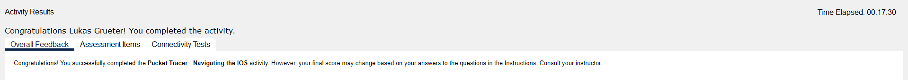

# Cisco Aufgabe 1

Part 1:

A) Connection erstellen
B) telnet, terminal, traceroute resp. telnet, terminal

Part 2:

1) Turn on privileged command
2) enable
3) prompt wird mit #
4) 5 Befehle

Part 3:

1) UTC Mon Mar1 1993
2) Kommand nicht vollständig
3) set
4) An vorgegebenem Raster orientieren

