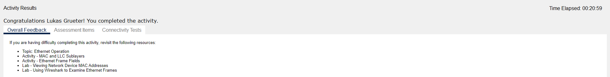

# Cisco Aufgabe 4

Questions:

Were there different types of cables/media used to connect devices?
 
Yes, both wired (Ethernet cables) and wireless connections are used.

Did the cables change the handling of the PDU in any way?
 
No, cables do not change the handling of PDUs; they only affect the transmission medium.

Did the Hub lose any of the information that it received?
 
Hubs typically do not lose information but can cause collisions since they broadcast to all ports.

What does the Hub do with MAC addresses and IP addresses?
 
A Hub does not process MAC or IP addresses; it simply forwards packets to all connected devices.

Did the wireless Access Point do anything with the information given to it?
 
The Access Point forwards data between wired and wireless networks, managing MAC addresses.

Was any MAC or IP address lost during the wireless transfer?
 
No. Wireless transmission should maintain MAC and IP integrity.

What was the highest OSI layer that the Hub and Access Point used?
 
The Hub operates at Layer 1 (Physical), while the Access Point operates at Layer 2 (Data Link).

Did the Hub or Access Point ever replicate a PDU that was rejected with a red “X”?
 
Yes, because the Packet was sent to clients which were not the receiver.

When examining the PDU Details tab, which MAC address appeared first, the source or the destination?
 
The source MAC address usually appears first.

Why would the MAC addresses appear in this order?
 
This order is standard for Ethernet frames, starting with the source and then the destination.

Was there a pattern to the MAC addressing in the simulation?
 
Typically, MAC addresses are unique to each device, often with vendor-specific prefixes.

Did the switches ever replicate a PDU that was rejected with a red “X”?
 
Switches should not replicate PDUs that are rejected.

Every time that the PDU was sent between the 10 network and the 172 network, there was a point where the MAC addresses suddenly changed. Where did that occur?
 
This likely occurs at the router, which routes traffic between different networks.

Which device uses MAC addresses that start with 00D0:BA?
 
All client devices.

What devices did the other MAC addresses belong to?
 
Each device in the network has a unique MAC address.

Did the sending and receiving IPv4 addresses change fields in any of the PDUs?
 
No, the sending and receiving IPv4 addresses remain constant within the same session.

When you follow the reply to a ping, sometimes called a pong, do you see the sending and receiving IPv4 addresses switch?
 
Yes, in a ping reply, the source and destination addresses switch.

What is the pattern to the IPv4 addressing used in this simulation?
 
The IP addresses are divided into different subnets (10.10.x.x and 172.16.x.x).

Why do different IP networks need to be assigned to different ports of a router?
 
To enable the router to correctly route traffic between different networks.

If this simulation was configured with IPv6 instead of IPv4, what would be different?
 
IPv6 addresses would be used, providing a larger address space and different routing protocols.

